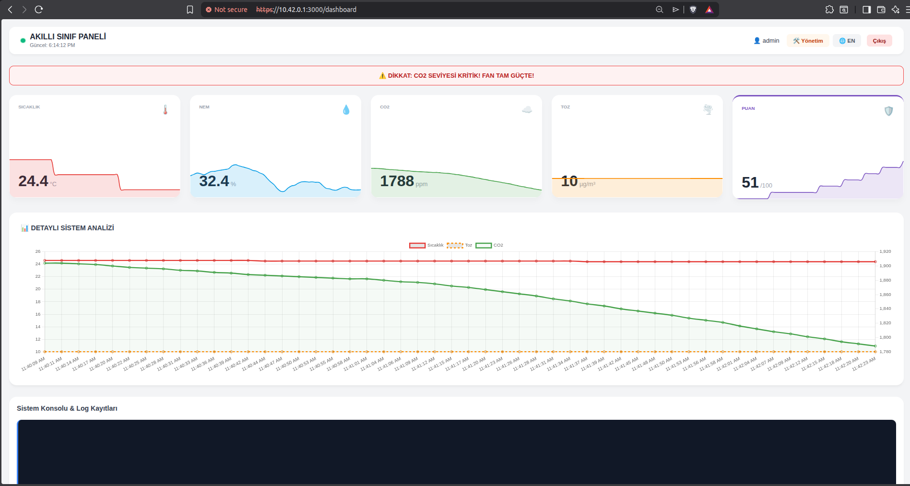
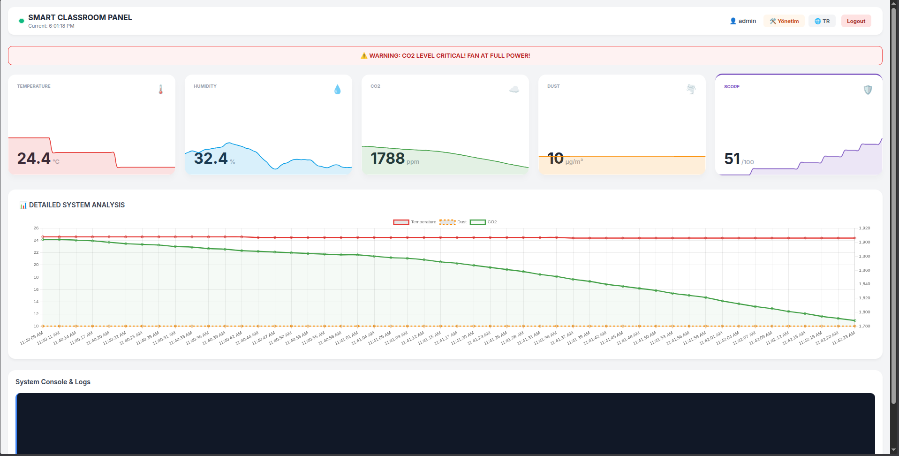
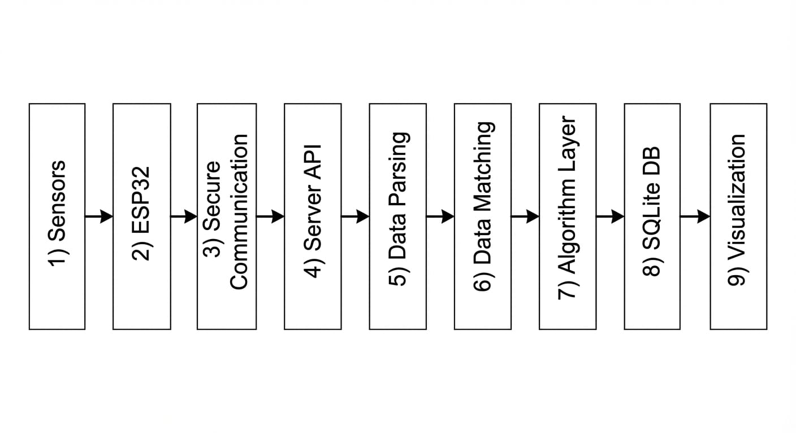
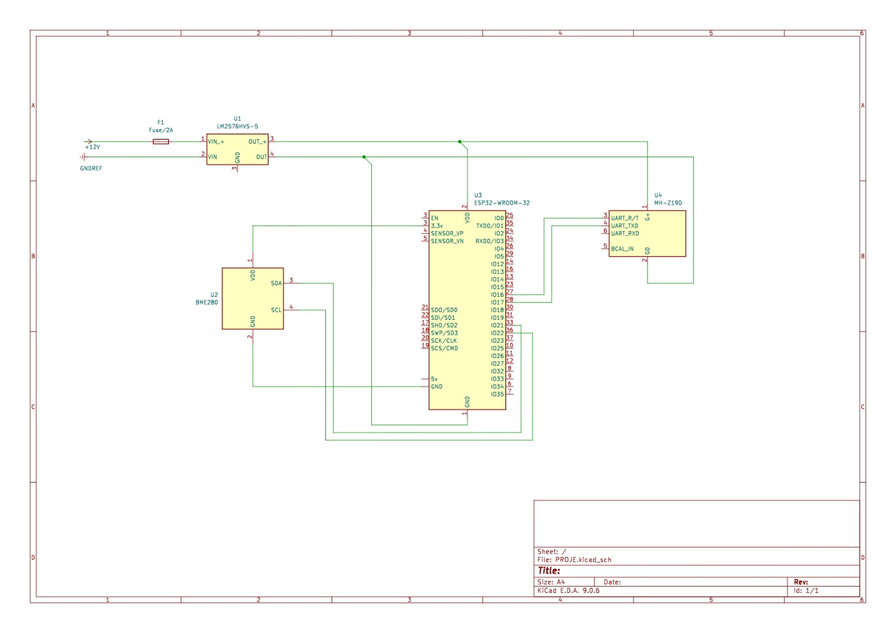
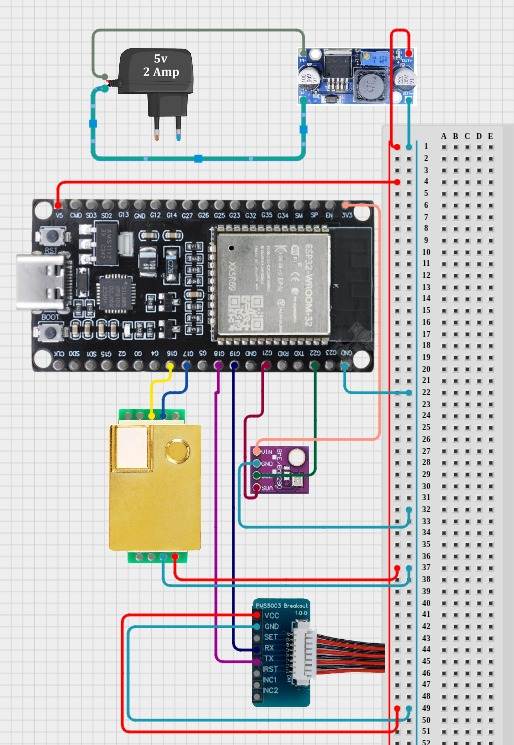
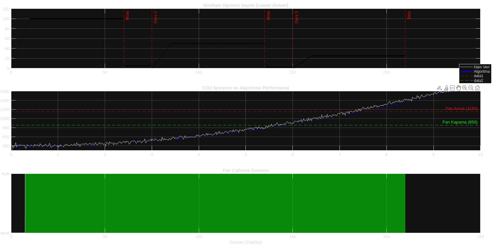
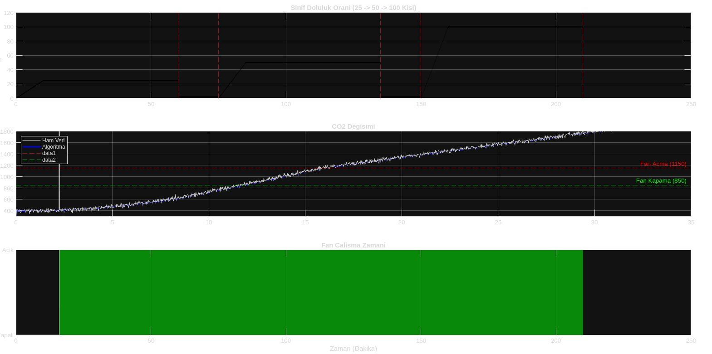
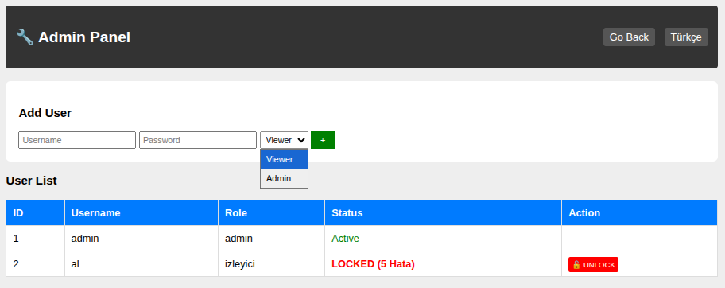

# 🏫 Smart Classroom Air Quality Monitoring System (IoT)


<p align="center">
  
  
</p>

## 📖 Overview
This project is a **Full-Stack IoT solution** designed to monitor and regulate air quality in high-capacity lecture halls. Unlike standard monitoring systems, it utilizes **Multi-Sensor Fusion** across distributed ESP32 nodes to calculate precise room averages and controls ventilation systems using **Hysteresis Algorithms**.

The system handles dynamic environments (100+ students) and ensures data integrity through a custom TCP-like protocol over WebSockets, running entirely on an offline Intranet.

---

## 🏗️ System Architecture & Logic

The system follows a modular architecture where multiple measurement nodes send data to a central Node.js server.

<p align="center">
  
  
</p>

### Power & Signal Architecture
The system is designed with a dedicated **Power Block** using LM2576 regulators to ensure stable 5V supply for sensitive sensors (MH-Z19D, ZH03B), preventing voltage drops common in USB-powered setups.

<p align="center">
  
</p>

---

## 🔌 Electronics & Circuit Design

The hardware design focuses on stability and noise reduction. The schematics include protection fuses (2A) and separated power lines for detection units and control units.

### Schematics (KiCad)
<p align="center">
  
  
</p>

### Wiring Simulation & Prototype
Below is the wiring diagram showing the connections between the ESP32, Buck Converter, and Sensors.

<p align="center">
  
  
</p>

---

## 📊 Algorithmic Verification (MATLAB)

Before deployment, the control algorithms were simulated using MATLAB to ensure stability.

### 1. Hysteresis Control Logic
To prevent the ventilation fans from oscillating rapidly (turning ON/OFF continuously), a hysteresis loop is implemented:
* **Fan ON:** Threshold > 1150 ppm
* **Fan OFF:** Threshold < 850 ppm

<p align="center">
  
</p>

### 2. Occupancy & Load Simulation
Simulation of CO2 accumulation rates based on student occupancy (25 -> 50 -> 100 students).

<p align="center">
  
</p>

---

## 💻 User Interface & Security

### Secure Login & Admin Panel
The system features a robust authentication mechanism. It tracks failed login attempts and **automatically locks the account** after 5 incorrect tries to prevent brute-force attacks.

<p align="center">
  
  
</p>

---

## 🛠️ Hardware Specifications

### Deployment Scenarios

#### Scenario A: Master Node (Full Sensing)
* **Code:** `firmware/Node_A_Master`
* **Sensors:** MH-Z19 (CO2), PMS5003 (Dust), BME280 (Temp/Hum).
* **Use Case:** Placed at the front of the class (Main pollution source).

#### Scenario B: Satellite Node (Comfort Sensing)
* **Code:** `firmware/Node_B_Satellite`
* **Sensors:** MH-Z19 (CO2), BME280 (Temp/Hum).
* **Use Case:** Placed at the back of the class.

---

## 🚀 Installation & Usage

1.  **Clone the Repository**
    ```bash
    git clone [https://github.com/Alprslnayhn/Smart-Classroom-IoT-System.git](https://github.com/Alprslnayhn/Smart-Classroom-IoT-System.git)
    ```

2.  **Backend Setup**
    ```bash
    cd backend
    npm install
    node db_setup.js  # Initialize SQLite Database
    node server.js    # Start the Server
    ```

3.  **Firmware Upload**
    * Open `firmware/Node_A_Master/main.ino` in Arduino IDE.
    * Upload to ESP32.
    * *Configure WiFi credentials via Serial Monitor (`SSID|PASS|IP`).*

---

## 🛡️ License
This project is licensed under the MIT License - see the [LICENSE](LICENSE) file for details.
